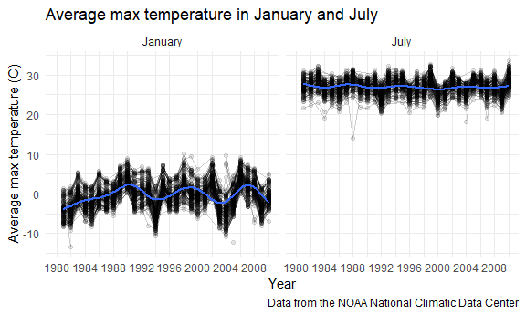
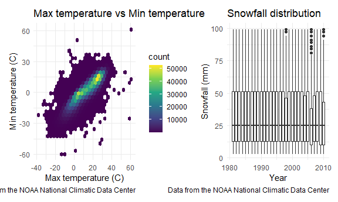

Homework 3
================
Cong Zhang
2020-10-09

This is my solution to Homework 3.

## Problem 1

``` r
data("instacart")
```

This dataset contains 1384617 rows and 15 columns.

Observations are the level of items in orders by user. There are user /
order variables – user ID, order ID, order day, and order hour. There
are also item variables – name, aisle, department, and some numeric
codes.

How many aisles, and which are most items from?

``` r
instacart %>% 
    count(aisle) %>% 
    arrange(desc(n))
```

    ## # A tibble: 134 x 2
    ##    aisle                              n
    ##    <chr>                          <int>
    ##  1 fresh vegetables              150609
    ##  2 fresh fruits                  150473
    ##  3 packaged vegetables fruits     78493
    ##  4 yogurt                         55240
    ##  5 packaged cheese                41699
    ##  6 water seltzer sparkling water  36617
    ##  7 milk                           32644
    ##  8 chips pretzels                 31269
    ##  9 soy lactosefree                26240
    ## 10 bread                          23635
    ## # ... with 124 more rows

Let’s make a plot

``` r
instacart %>% 
    count(aisle) %>% 
    filter(n > 10000) %>% 
    mutate(
        aisle = factor(aisle),
        aisle = fct_reorder(aisle, n)
    ) %>% 
    ggplot(aes(x = aisle, y = n)) + 
    geom_point() + 
    theme(axis.text.x = element_text(angle = 90, vjust = 0.5, hjust = 1))
```


Let’s make a table\!\!

``` r
instacart %>% 
    filter(aisle %in% c("baking ingredients", "dog food care", "packaged vegetables fruits")) %>% 
    group_by(aisle) %>% 
    count(product_name) %>% 
    mutate(rank = min_rank(desc(n))) %>% 
    filter(rank < 4) %>% 
    arrange(aisle, rank) %>% 
    knitr::kable()
```

| aisle                      | product\_name                                 |    n | rank |
| :------------------------- | :-------------------------------------------- | ---: | ---: |
| baking ingredients         | Light Brown Sugar                             |  499 |    1 |
| baking ingredients         | Pure Baking Soda                              |  387 |    2 |
| baking ingredients         | Cane Sugar                                    |  336 |    3 |
| dog food care              | Snack Sticks Chicken & Rice Recipe Dog Treats |   30 |    1 |
| dog food care              | Organix Chicken & Brown Rice Recipe           |   28 |    2 |
| dog food care              | Small Dog Biscuits                            |   26 |    3 |
| packaged vegetables fruits | Organic Baby Spinach                          | 9784 |    1 |
| packaged vegetables fruits | Organic Raspberries                           | 5546 |    2 |
| packaged vegetables fruits | Organic Blueberries                           | 4966 |    3 |

Apples vs ice cream..

``` r
instacart %>% 
    filter(product_name %in% c("Pink Lady Apples", "Coffee Ice Cream")) %>% 
    group_by(product_name, order_dow) %>% 
    summarize(mean_hour = mean(order_hour_of_day)) %>% 
    pivot_wider(
        names_from = order_dow,
        values_from = mean_hour
    )
```

    ## `summarise()` regrouping output by 'product_name' (override with `.groups` argument)

    ## # A tibble: 2 x 8
    ## # Groups:   product_name [2]
    ##   product_name       `0`   `1`   `2`   `3`   `4`   `5`   `6`
    ##   <chr>            <dbl> <dbl> <dbl> <dbl> <dbl> <dbl> <dbl>
    ## 1 Coffee Ice Cream  13.8  14.3  15.4  15.3  15.2  12.3  13.8
    ## 2 Pink Lady Apples  13.4  11.4  11.7  14.2  11.6  12.8  11.9

## Problem 2

Load, tidy, and otherwise wrangle the data.

``` r
accel_df = 
    read_csv("./data/accel_data.csv") %>% 
    janitor::clean_names() %>% 
  pivot_longer(
    activity_1:activity_1440,
    names_to = "minute_raw",
    values_to = "activity_counts"
  ) %>% 
  separate(minute_raw, into = c("raw", "minute"), convert = TRUE) %>% 
    mutate(
      week = as.integer(week),
      day_id = as.integer(day_id),
      day = as.factor(day),
      day = ordered(day, levels = c("Monday", "Tuesday", "Wednesday", "Thursday", "Friday", "Saturday", "Sunday")),
    weekday = case_when(
      day %in% c("Monday", "Tuesday", "Wednesday", "Thursday", "Friday") ~ "weekday",
      day %in% c("Saturday", "Sunday") ~ "weekend",
      TRUE ~ ""
    ),
      weekday = as.factor(weekday)
    ) %>% 
    select(week:day, weekday, minute, activity_counts)
```

The resulting dataset `accel_df` contains the following 6 variables:
week, day\_id, day, weekday, minute, activity\_counts. It has 50400
observations, and the dimension is 50400 x 6.

Create daily total activity variable and corresponding table.

``` r
accel_df %>% 
  group_by(week, day) %>%
  summarize(total_activity = sum(activity_counts)) %>% 
  knitr::kable(digits = 2)
```

    ## `summarise()` regrouping output by 'week' (override with `.groups` argument)

| week | day       | total\_activity |
| ---: | :-------- | --------------: |
|    1 | Monday    |        78828.07 |
|    1 | Tuesday   |       307094.24 |
|    1 | Wednesday |       340115.01 |
|    1 | Thursday  |       355923.64 |
|    1 | Friday    |       480542.62 |
|    1 | Saturday  |       376254.00 |
|    1 | Sunday    |       631105.00 |
|    2 | Monday    |       295431.00 |
|    2 | Tuesday   |       423245.00 |
|    2 | Wednesday |       440962.00 |
|    2 | Thursday  |       474048.00 |
|    2 | Friday    |       568839.00 |
|    2 | Saturday  |       607175.00 |
|    2 | Sunday    |       422018.00 |
|    3 | Monday    |       685910.00 |
|    3 | Tuesday   |       381507.00 |
|    3 | Wednesday |       468869.00 |
|    3 | Thursday  |       371230.00 |
|    3 | Friday    |       467420.00 |
|    3 | Saturday  |       382928.00 |
|    3 | Sunday    |       467052.00 |
|    4 | Monday    |       409450.00 |
|    4 | Tuesday   |       319568.00 |
|    4 | Wednesday |       434460.00 |
|    4 | Thursday  |       340291.00 |
|    4 | Friday    |       154049.00 |
|    4 | Saturday  |         1440.00 |
|    4 | Sunday    |       260617.00 |
|    5 | Monday    |       389080.00 |
|    5 | Tuesday   |       367824.00 |
|    5 | Wednesday |       445366.00 |
|    5 | Thursday  |       549658.00 |
|    5 | Friday    |       620860.00 |
|    5 | Saturday  |         1440.00 |
|    5 | Sunday    |       138421.00 |

From the table, we could see that the activities on Tuesdays and
Wednesdays are more stable than other days.

Make a single-panel plot.

``` r
ggp_activity_plot = 
  accel_df %>% 
  ggplot(aes(x = minute, y = activity_counts, color = day)) + 
  geom_line(alpha = .5) + 
  geom_smooth(se = FALSE) + 
  labs(
    title = "Activity counts plot",
    x = "Minute of the day",
    y = "Activity counts",
    caption = "Data from the accel_data.csv file"
  ) + 
  viridis::scale_color_viridis(
    name = "Day", 
    discrete = TRUE
  )

ggp_activity_plot
```

    ## `geom_smooth()` using method = 'gam' and formula 'y ~ s(x, bs = "cs")'


From this graph, we could see that the activity counts of night are
normally larger than the activity counts of the daytime, and the
activity counts of midnight are the lowest of all day. Generally
speaking, Friday night and Sunday morning seem to have higher activity
counts than other time.

## Problem 3

Load and describe the NY NOAA data.

``` r
data("ny_noaa")
```

The dataset `ny_noaa` contains the following 7 variables: id, date,
prcp, snow, snwd, tmax, tmin. It has 2595176 observations, and the
dimension is 2595176 x 7. This dataset has many missing values. prcp has
145838 missing values. snow has 381221 missing values. snwd has 591786
missing values. tmax has 1134358 missing values. tmin has 1134420
missing values.

Clean the NY NOAA data.

``` r
ny_noaa = 
    ny_noaa %>% 
    janitor::clean_names() %>% 
  separate(date, into = c("year", "month", "day"), convert = TRUE) %>% 
    mutate(
      id = as.factor(id),
      tmax = as.numeric(tmax),
      tmin = as.numeric(tmin),
      prcp = prcp / 10,
      tmax = tmax / 10,
      tmin = tmin / 10,
  )
```

``` r
snow_freq_df =
  ny_noaa %>%
  group_by(snow) %>%
  summarize(snow_freq = n()) %>% 
  arrange(desc(snow_freq)) %>% 
  head(n = 1)
```

    ## `summarise()` ungrouping output (override with `.groups` argument)

For snowfall, the most commonly observed values are 0, because there are
2008508 observations have a snow value of 0, which are the most
frequent.

Make a two-panel plot showing the average max temperature in January and
in July in each station across years.

``` r
ny_noaa %>% 
  group_by(id, year, month) %>% 
  summarise(mean_tmax = mean(tmax, na.rm = TRUE)) %>% 
  filter(month %in% c(1,7)) %>% 
    mutate(month = month.name[month]) %>%   
  ggplot(aes(x = year, y = mean_tmax)) + 
    geom_point(alpha = .1) + 
    geom_path(aes(group = id), alpha = .2) + 
    geom_smooth(se = FALSE) + 
    facet_grid(. ~ month) + 
    labs(
      title = "Average max temperature in January and July", 
      x = "Year", 
      y = "Average max temperature (C)",
      caption = "Data from the NOAA National Climatic Data Center"
    ) + 
    scale_x_continuous(
      limits = c(1980, 2010),
      n.breaks = 10
    )
```

    ## `summarise()` regrouping output by 'id', 'year' (override with `.groups` argument)

    ## `geom_smooth()` using method = 'gam' and formula 'y ~ s(x, bs = "cs")'

    ## Warning: Removed 5970 rows containing non-finite values (stat_smooth).

    ## Warning: Removed 5970 rows containing missing values (geom_point).

    ## Warning: Removed 5931 row(s) containing missing values (geom_path).



Across these years, the average max temperatures in July are much higher
than those in January. The average max temperatures in July are more
stable, while the average max temperatures in January have relatively
bigger fluctuations. There are also many outliers. The most obvious
outliers in January are in 1982, 1993, 1999, 2000, 2004, 2005, and 2008.
The most obvious outliers in July are in 1981, 1982, 1983, 1984, 1988,
1989, 2004, and 2007. From the graphs, we could not see any trend of
global warming across these years.

Make two plots.

``` r
tmax_tmin_plot = 
  ny_noaa %>% 
  ggplot(aes(x = tmax, y = tmin)) + 
    geom_hex() + 
    labs(
      title = "Max temperature vs Min temperature",
      x = "Max temperature (C)",
      y = "Min temperature (C)",
      caption = "Data from the NOAA National Climatic Data Center"
    ) + 
    theme(legend.position = "right")

snowfall_plot = 
  ny_noaa %>% 
  filter(snow > 0 & snow < 100) %>% 
  ggplot(aes(x = year, y = snow, group = year)) + 
  geom_boxplot() + 
  labs(
    title = "Snowfall distribution",
    x = "Year",
    y = "Snowfall (mm)",
    caption = "Data from the NOAA National Climatic Data Center"
  )

tmax_tmin_plot + snowfall_plot
```

    ## Warning: Removed 1136276 rows containing non-finite values (stat_binhex).



From the graphs, we could see that there may be a linear correlation
between the max temperature and min temperature, and the snowfall values
tend to have similar distributions across the years, with year 1998,
2006, 2010 being somewhat different.
